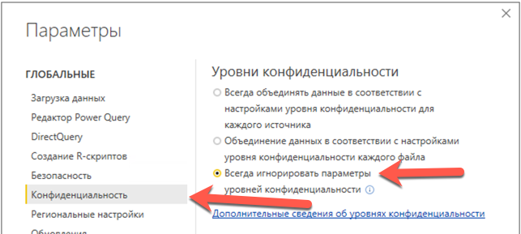
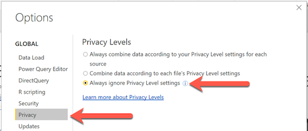
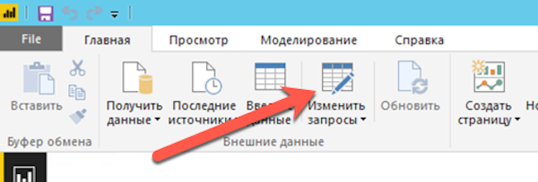
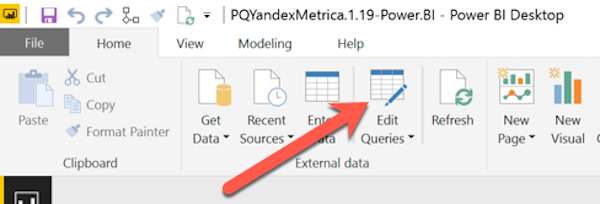
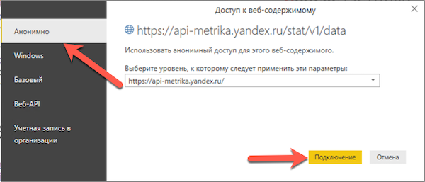

## Оглавление

<!-- MarkdownTOC autoanchor="true" autolink="true" uri_encoding="false" markdown_preview="" levels="1,2,3,4,5" -->

- [Быстрый старт использования PQYandexMetrica для Power BI \(pbix\)](#Быстрый-старт-использования-pqyandexmetrica-для-power-bi-pbix)
- [Видео из курса Максим Уварова Power BI для интернет-маркетинга](#Видео-из-курса-Максим-Уварова-power-bi-для-интернет-маркетинга)
	- [Термины Яндекс.Метрики. Базовая настройка PQYandexMetrica](#Термины-ЯндексМетрики-Базовая-настройка-pqyandexmetrica)
	- [Получение статистики по достижениям целей](#Получение-статистики-по-достижениям-целей)
	- [Задание модели атрибуции в выгрузке](#Задание-модели-атрибуции-в-выгрузке)
	- [Выгрузка данных по расходам Яндекс.Директ из api Яндекс.Метрики](#Выгрузка-данных-по-расходам-ЯндексДирект-из-api-ЯндексМетрики)
	- [Копирование запросов между PBIX и XLSX файлами](#Копирование-запросов-между-pbix-и-xlsx-файлами)
	- [Отзыв токена Яндекс.Метрики](#Отзыв-токена-ЯндексМетрики)
	- [Видео мастер-класса Максима Уварова на вебмастерской конференции](#Видео-мастер-класса-Максима-Уварова-на-вебмастерской-конференции)
- [Примеры отчетов](#Примеры-отчетов)
	- [Отчет 1](#Отчет-1)
	- [Отчет 2](#Отчет-2)
- [Отказ от ответственности \(disclaimer\)](#Отказ-от-ответственности-disclaimer)
- [Полезные ссылки](#Полезные-ссылки)

<!-- /MarkdownTOC -->

<a id="Быстрый-старт-использования-pqyandexmetrica-для-power-bi-pbix"></a>
## Быстрый старт использования PQYandexMetrica для Power BI (pbix)

1. Скачиваем последнюю версию PBIX файла по [ссылке](https://github.com/maxim-uvarov/PQYandexMetrica/tree/master/Releases)
2. Открываем файл. Переходим в настройки Power BI 
=> Конфиденциальность => Уровни Конфиденциальности => Всегда игнорировать параметры уровней конфиденциальности

=> Privacy => Privacy Levels => Always Ignore Privacy Level settings

3. Переходим по [ссылке](https://oauth.yandex.ru/authorize?response_type=token&client_id=dbb281abcd134b1bb4c624748f03cffe), жмем кнопку "разрешить", копируем предоставленный токен, он понадобится нам дальше
4. Возвращаемся в Power BI, жмем на кнопку "Изменить запросы" 

"Edit Queries"

5. В окне с запросами слева выбираем функцию PQYM, заполняем все поля необходиыми настройками, жмем кнопку "Вызвать"
6. Должно появиться окно с выбором настроек доступа. Оставляем настройки по умолчанию - анонимный доступ и жмем на кнопку подключение

7. Если все настройки произведены правильно, то новый запрос должен отобразить полученную из Яндекс.Метрики таблицу с данными.

<a id="Видео-из-курса-Максим-Уварова-power-bi-для-интернет-маркетинга"></a>
## Видео из курса Максим Уварова [Power BI для интернет-маркетинга](https://learn.needfordata.ru/pbi)

<a id="Термины-ЯндексМетрики-Базовая-настройка-pqyandexmetrica"></a>
### Термины Яндекс.Метрики. Базовая настройка PQYandexMetrica

Группировка (dimension) — это атрибут визита или хита, по которому можно сгруппировать данные.

В запросах к API группировки задаются в параметре dimensions. Если необходимо указать несколько группировок, перечислите их через запятую.

Также возможен отчет без группировок, в этом случае будет рассчитан суммарный результат.

Метрика (metric) — числовая величина, которая рассчитывается на основе атрибута хита или визита.

В запросах к API метрики задаются в параметре metrics. Если необходимо указать несколько метрик, перечислите их через запятую.

Неполный список группировок и метрик есть в [справке Яндекс.Метрики](https://tech.yandex.ru/metrika/doc/api2/api_v1/attrandmetr/dim_all-docpage/). 

Расширенный список доступных измерений и метрик полученных по api в [Excel Online](https://nfd2-my.sharepoint.com/:x:/g/personal/maximum_nfd2_onmicrosoft_com/EUtMMpBUbxxMkkA-E9JrqycBh4dez9LHrNAJF4m_6vbt3Q?e=Dt4eLl) или [Google Spreadsheets](https://docs.google.com/spreadsheets/d/1zWAq_wYQymYcJvKV-XcodNVTYu5ZiZJ2YqKWhscPf0Y/edit#gid=629438640).

API поддерживает три типа группировок и метрик:

  * Визиты — имеют префикс `ym:s:`
  * Хиты — имеют префикс `ym:pv:`
  * Данные по рекламе - имеют префикс `ym:ad:`

В одном запросе нельзя использовать разные префиксы, а также указывать больше одного множества (см. раздел [Множества и отношения](https://tech.yandex.ru/metrika/doc/api2/api_v1/segmentation-docpage/#sets)).

  
Даты для получения отчетов можно задавать:
  * 2016-11-28
  * today
  * yesterday
  * 365daysAgo (где 365 количество дней назад, которое вы можете заменить на нужное вам число)

PQYandexMetrica поддерживает использование фильтров. Правила работы с фильтрами в api приведены в [справке Яндекс.Метрики](https://tech.yandex.ru/metrika/doc/api2/api_v1/segmentation-docpage/) 


<div style="padding:56.25% 0 0 0;position:relative;"><iframe src="https://player.vimeo.com/video/193161266?title=0&byline=0&portrait=0" style="position:absolute;top:0;left:0;width:100%;height:100%;" frameborder="0" webkitallowfullscreen mozallowfullscreen allowfullscreen></iframe></div><script src="https://player.vimeo.com/api/player.js"></script>
  
  
<a id="Получение-статистики-по-достижениям-целей"></a>
### Получение статистики по достижениям целей

В API Яндекс.Метрики есть следующие метрики, относящиеся к целям:  

* `ym:s:goal<goal_id>reaches` - общее число достижений цели (за один визит может быть несколько достижений цели)
* `ym:s:goal<goal_id>visits` - общее число визитов, во время которых цель была достигнута
* `ym:s:goal<goal_id>users` - общее число пользователей, которые когда-либо достигали выбранной цели. 

В перечисленных метриках `<goal_id>` нужно заменить на id запрашиваемой цели. Этот id можно найти на странице настройка счетчика, на вкладке цели (см [скриншот](https://pqyandexmetrica.ru/images/metricagoalids1.png))

Вот [справка на параметризацию запросов в метрике](https://tech.yandex.ru/metrika/doc/api2/api_v1/param-docpage/).

<div style="padding:56.25% 0 0 0;position:relative;"><iframe src="https://player.vimeo.com/video/262263858?title=0&byline=0&portrait=0" style="position:absolute;top:0;left:0;width:100%;height:100%;" frameborder="0" webkitallowfullscreen mozallowfullscreen allowfullscreen></iframe></div><script src="https://player.vimeo.com/api/player.js"></script>

  
<a id="Задание-модели-атрибуции-в-выгрузке"></a>
### Задание модели атрибуции в выгрузке

Атрибуцию в соответствующих группировках (например, в группировке `ym:s:<attribution>TrafficSource`) можно задавать при помощи слов:  

* `first` (первый источник)
* `last` (последний источник) - по умолчанию
* `lastsign` (последний значимый источник) - самая пацанская атрибуция

Вот [справка на параметризацию запросов в метрике](https://tech.yandex.ru/metrika/doc/api2/api_v1/param-docpage/).

<div style="padding:56.25% 0 0 0;position:relative;"><iframe src="https://player.vimeo.com/video/262264299?title=0&byline=0&portrait=0" style="position:absolute;top:0;left:0;width:100%;height:100%;" frameborder="0" webkitallowfullscreen mozallowfullscreen allowfullscreen></iframe></div><script src="https://player.vimeo.com/api/player.js"></script>

  
<a id="Выгрузка-данных-по-расходам-ЯндексДирект-из-api-ЯндексМетрики"></a>
### Выгрузка данных по расходам Яндекс.Директ из api Яндекс.Метрики

Если вы хотите выгружать из метрики данные по рекламным сущностям - у них стоит приставка ym:ad: (например, по расходам в Яндекс.Директ `ym:ad:<currency>AdCost`), то вам потребуется заполнить поле direct_ids (это числовой id вашего рекламного кабинет в Яндекс.Директ). Получить список id рекламных кабинетов, доступных для конкретного счетчика, вы сможете используя функцию GetDirectIDs.

<div style="padding:56.25% 0 0 0;position:relative;"><iframe src="https://player.vimeo.com/video/262264288?title=0&byline=0&portrait=0" style="position:absolute;top:0;left:0;width:100%;height:100%;" frameborder="0" webkitallowfullscreen mozallowfullscreen allowfullscreen></iframe></div><script src="https://player.vimeo.com/api/player.js"></script>
  
  
<a id="Копирование-запросов-между-pbix-и-xlsx-файлами"></a>
### Копирование запросов между PBIX и XLSX файлами

Запросы в Power Query можно копировать между PBIX и XLSX файлами. Для этого надо открыть Power Query, в правой панели выбрать интересующие запросы (несколько запросов можно выбрать зажав клавишу ctrl). После того как запрос скопирован в буфер обмена вы можете его вставить в Power Query в Excel или Power BI.

<div style="padding:56.25% 0 0 0;position:relative;"><iframe src="https://player.vimeo.com/video/262268793?title=0&byline=0&portrait=0" style="position:absolute;top:0;left:0;width:100%;height:100%;" frameborder="0" webkitallowfullscreen mozallowfullscreen allowfullscreen></iframe></div><script src="https://player.vimeo.com/api/player.js"></script>
  
  
<a id="Отзыв-токена-ЯндексМетрики"></a>
### Отзыв токена Яндекс.Метрики 

В случае, если есть подозрение, что ваш токен попал в чужие руки, вы всегда можете отозвать старый токен по ссылке: [https://passport.yandex.ru/profile/access](https://passport.yandex.ru/profile/access)

<div style="padding:56.25% 0 0 0;position:relative;"><iframe src="https://player.vimeo.com/video/198110945?title=0&byline=0&portrait=0" style="position:absolute;top:0;left:0;width:100%;height:100%;" frameborder="0" webkitallowfullscreen mozallowfullscreen allowfullscreen></iframe></div><script src="https://player.vimeo.com/api/player.js"></script>
  
  
<a id="Видео-мастер-класса-Максима-Уварова-на-вебмастерской-конференции"></a>
### Видео мастер-класса Максима Уварова на вебмастерской конференции
<style>.embed-container { position: relative; padding-bottom: 56.25%; height: 0; overflow: hidden; max-width: 100%; } .embed-container iframe, .embed-container object, .embed-container embed { position: absolute; top: 0; left: 0; width: 100%; height: 100%; }</style><div class='embed-container'><iframe src='https://www.youtube.com/embed/UbehqWkzjO8?start=208' frameborder='0' allowfullscreen></iframe></div>
  
<a id="Примеры-отчетов"></a>
## Примеры отчетов

В примерах ниже приведены конфигурации действующих отчетов проекта <marketing-wiki.ru> с активным токеном. Не забудьте изменить токен и id счетчика, если захотите получить подобный отчет для своего проекта. 

Обозначение параметров по порядку:
```
= PQYM (ids , metrics, dimensions, date1, date2, token, filters, direct_ids) 
```

Все параметры передаются как Text. При перечислении ids, metrics, dimensions, filters, direct_ids - если внутри параметра используется несколько сущностей (например, несколько группировок), то они передаются через запятую, без пробелов.

<a id="Отчет-1"></a>
### Отчет 1

С фильтром по переходам из Поисковых Систем (последний значимый источник), со статистикой по количеству визитов, средней длительностью визита и абсолютным числом отказов за период с 1 января 2019 года по вчера.

```
= PQYM("21781912", 
    "ym:s:visits,ym:s:avgVisitDuration,ym:s:bounces", 
    "ym:s:date,ym:s:lastsignTrafficSource", 
    "2019-01-01", 
    "yesterday", 
    "AQAAAAAQy8J1AAPquhq4JeyqQE6ygfUNoMnGr8E", 
    "ym:s:lastsignTrafficSourceName=='Переходы из поисковых систем'", 
    null)
```


<a id="Отчет-2"></a>
### Отчет 2

Отчет по адресам страниц, со статистикой по количеству просмотров и пользователей, посетивших страницу за последние 365 дней (по вчера).

```
= PQYM("21781912", 
    "ym:pv:pageviews,ym:pv:users", 
    "ym:pv:URLPath", 
    "365daysAgo", 
    "1daysAgo", 
    "AQAAAAAQy8J1AAPquhq4JeyqQE6ygfUNoMnGr8E", 
    null, 
    null)
```

<a id="Отказ-от-ответственности-disclaimer"></a>
## Отказ от ответственности (disclaimer) ##

Программа создавалась для собственного пользования и распространяется по доброте душевной в состоянии как есть (под лицензией GPLv3 <http://s.40-02.ru/1DHW9dz>). 
Автор не несет ответственности за ущерб, который можно получить при использовании данной програмы.
Если у вас появилось желание сказать спасибо за данную программу, можете написать автору на pqyandexmetrika@40-02.com. 


<a id="Полезные-ссылки"></a>
## Полезные ссылки

2. [Скачать надстройку Power Query для Excel 2010 и 2013](https://www.microsoft.com/en-us/download/details.aspx?id=39379&WT.mc_id=Blog_PBI_Announce_DI)
3. [PQGoogleAnalytics, проект на гитхабе](https://github.com/40-02/PQGoogleAnalytics)
4. [Справка по api Яндекс.Метрики](https://tech.yandex.ru/metrika/doc/api2/api_v1/intro-docpage/)
6. [Правила работы с фильтрами в api](https://tech.yandex.ru/metrika/doc/api2/api_v1/segmentation-docpage/) 
5. [Неполный список измерений и метрик в api в справке метрики](https://tech.yandex.ru/metrika/doc/api2/api_v1/attrandmetr/dim_all-docpage/)
6. Расширенный список доступных измерений и метрик полученных по api в [Excel Online](https://needfordata-my.sharepoint.com/:x:/r/personal/max_needfordata_ru/_layouts/15/Doc.aspx?sourcedoc=%7B48dbf278-2be3-499f-9181-f3e5327a6b8a%7D&action=default) или [Google Spreadsheets](https://docs.google.com/spreadsheets/d/1zWAq_wYQymYcJvKV-XcodNVTYu5ZiZJ2YqKWhscPf0Y/edit#gid=629438640)
1. [Статья в marketing-wiki об использовании коннектора](http://marketing-wiki.ru/wiki/Экспорт_данных_из_сервиса_Яндекс.Метрика_в_excel_(power_query))

update
